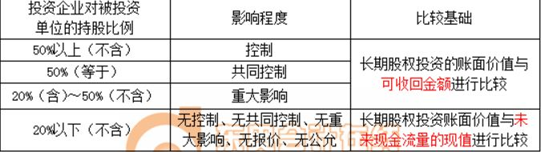
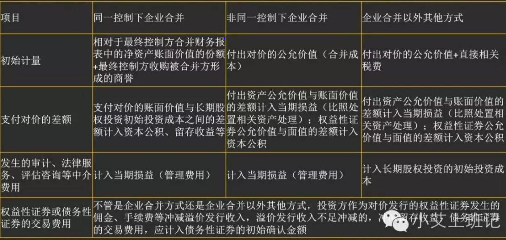

# CAS2_长投
## *确认*
子公司，联营，合营

ATTENTION：在判断是否为总大影响时，应当考虑可转债，当期
认股权证多种因素
## *初始计量*

## *后续计量*
#### 成本法和权益法

成本法--------------------------------------------------------------------------权益法

子公司--------------------------------------------------------------------------合营公司&联营公司

初始成本无需调整--------------------------------------------------------------按初始成本与被投资单位净资产公允价值份额孰高计量（差额计入营外）

盈利时不做处理----------------------------------------------------------------增加长投（损益调整）账面价值，计入投资收益

亏损时不做处理----------------------------------------------------------------减计长投（损益调整）账面价值，计入投资收益

宣告发放现金股利时增加应收股利并计入投资收益---------------------------增加应收股利，同时减计长投账面价值

宣告发放股票股利时不做处理--------------------------------------------------同样不做处理

其他综合收益和其他权益变动发生变化时不做处理---------------------------增加或减少长投的账面价值（注意二级明细），计入其他综合收益或资本公积-其他资本公积

ADDING：其他综合收益指无法直接计入当期损益而直接计入所有者权益的利得和损失，比如可供出售金融资产公允价值的变动（他并没有实际的资金流入流出，只是价格波动，是一种未来潜在收益，不能让他影响当期利润）；
其他资本公积原来是将其他综合收益这一块也包含在内的，现在就是被提出来，其他与之前没什么区别，他主要就是与投入资本的变化相关。

ATTENTION：注意权益法下按照对方损益乘以持股比例时，一定要先按照公允价值模式对净利润进行调节。   
#### 成本法和去权益法的相互转换
1.成本转权益

2.权益转成本
## *期末计价*
## *处置*
## *披露*